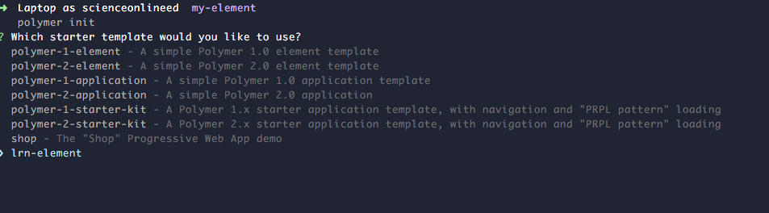

## Installation

Clone this repo
```bash
git clone
npm install
npm link
```

Make the folder for your element

```bash
mkdir my-element
cd my-element
```

Create the element with polymer init and choose the LRN option

```bash
polymer init
  - LRN component
    - element
```

Now just run Polymer serve!

```bash
polymer serve
```
