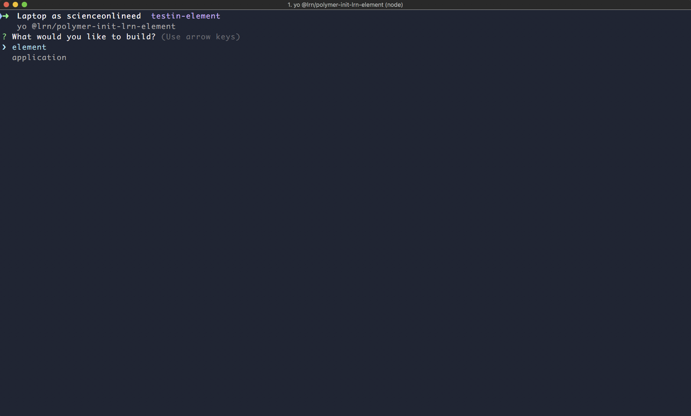

## Installation

```bash
npm install -g yo
npm install -g bower
npm install -g polymer-cli
npm install -g @lrn/generator-polymer-init-lrn-element
```

Make the folder for your element

```bash
mkdir my-element
cd my-element
```

Create the element with polymer init and choose the LRN option

```bash
yo @lrn/generator-polymer-init-lrn-element
  - LRN component
    - element
```

Now just run Polymer serve!

```bash
polymer serve
```
